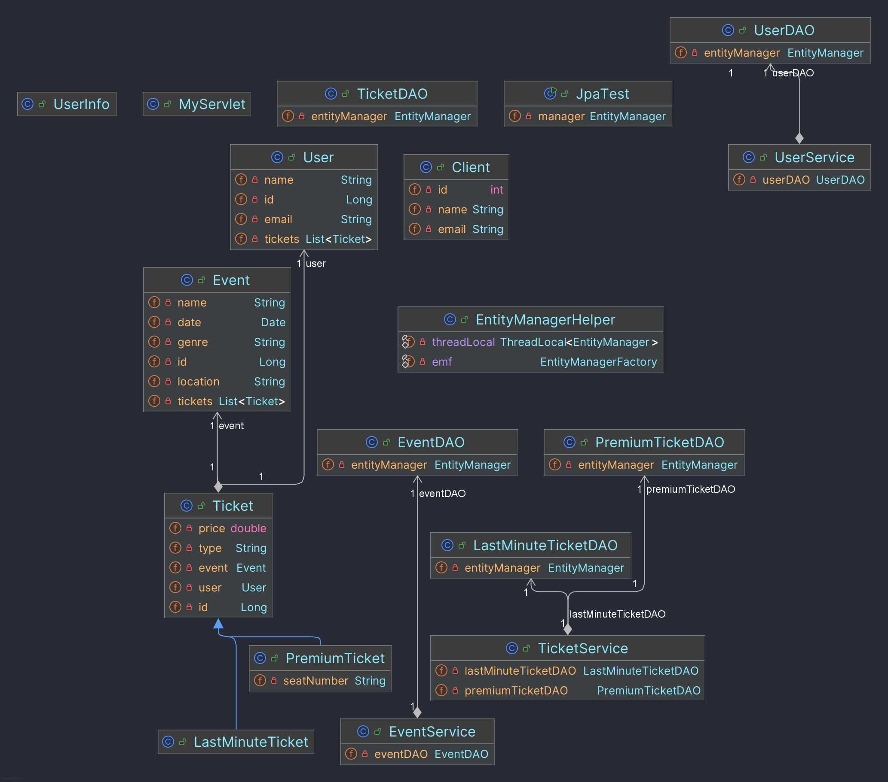

# Compte rendu TP back-end
Voici pour l'instant mon diagramme de classe.

Le code utilise actuellement une bdd mysql en local, les param sont présents dans le fichier
persistence.xml, il vous faudra changer les paramétres pour votre environnement.
La partie JPA est fonctionnelle, les relations entre les tables sont bien gérées (1-1 et many to one etc.).
J'ai commencé la partie servlet, mais n'ai pas eu le temps encore de l'approfondir pour l'instant.
pour tester les classes il vous suffit de lancer le main de la classe JpaTest.java, mais l'exemple présent en ce moment n'est pas très démonstratif
cependant il vous permettra de voir que la connexion à la bdd fonctionne bien et que les écritures et relation en BDD sont bien gérées.
Je n'ai pas encore eu le temps de faire les tests unitaires, mais je vais m'y atteler dès que possible.
Je n'ai pas eu le temps de faire une démonstration non plus de l'utilisation des classes de services et DA mais celle-ci sont fonctionnelles. (testé manuellment dans une classe Main)
A la reprise, je compte enrichi mon modéle pour être plus complet.
Terminer la partie servlet et API et faire des tests unitaires.

